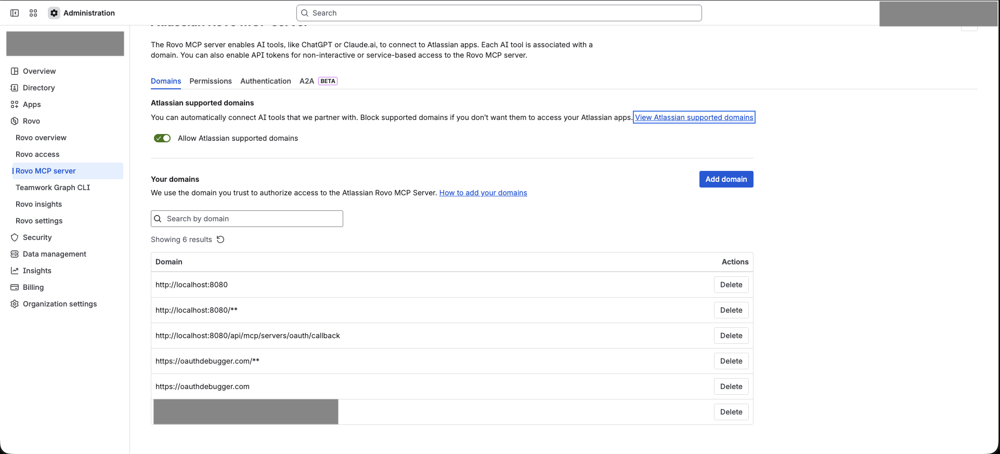

# Registering Your Application as an Atlassian MCP Client

This guide explains how to register your application as an OAuth client for the [Atlassian Rovo MCP Server](https://support.atlassian.com/atlassian-rovo-mcp-server/docs/getting-started-with-the-atlassian-remote-mcp-server/), configure authentication, and connect to Jira, Confluence, and Compass via the Model Context Protocol (MCP).

---

## Overview

The [**Atlassian Rovo MCP Server**](https://support.atlassian.com/atlassian-rovo-mcp-server/docs/getting-started-with-the-atlassian-remote-mcp-server/) exposes Jira, Confluence, and Compass tools over the Model Context Protocol. To integrate your application, you must:

1. Register as an OAuth 2.0 / 2.1 client
2. Configure OAuth endpoints in your application
3. Implement the authorization flow (authorize → callback → token exchange)
4. Use the access token for MCP requests
5. Handle token refresh when access tokens expire

---

## Prerequisites

Before you begin, ensure you have:

- An **Atlassian Cloud site** with Jira, Compass, and/or Confluence
- Access to **Atlassian Administration** (or Atlassian Developer) to register your app
- A frontend application that can handle OAuth redirects and store tokens
- A modern browser for the OAuth authorization flow

---

## 1. OAuth Discovery

Atlassian exposes OAuth metadata at a well-known URL. Use this to obtain endpoint URLs and supported features.

**Discovery URL:** [https://mcp.atlassian.com/.well-known/oauth-authorization-server](https://mcp.atlassian.com/.well-known/oauth-authorization-server)

Example response:

```json
{
  "issuer": "https://cf.mcp.atlassian.com",
  "authorization_endpoint": "https://mcp.atlassian.com/v1/authorize",
  "token_endpoint": "https://cf.mcp.atlassian.com/v1/token",
  "registration_endpoint": "https://cf.mcp.atlassian.com/v1/register",
  "response_types_supported": [
    "code"
  ],
  "response_modes_supported": [
    "query"
  ],
  "grant_types_supported": [
    "authorization_code",
    "refresh_token"
  ],
  "token_endpoint_auth_methods_supported": [
    "client_secret_basic",
    "client_secret_post",
    "none"
  ],
  "revocation_endpoint": "https://cf.mcp.atlassian.com/v1/token",
  "code_challenge_methods_supported": [
    "plain",
    "S256"
  ]
}
```

Key endpoints:

| Purpose | URL |
|--------|-----|
| Authorize (user consent) | `https://mcp.atlassian.com/v1/authorize` |
| Token exchange & refresh | `https://cf.mcp.atlassian.com/v1/token` |
| Client registration | `https://cf.mcp.atlassian.com/v1/register` |
| MCP server endpoint | `https://mcp.atlassian.com/v1/mcp` |

---

## 2. Registering Your Application

### Step 1: Create an OAuth App

1. Use the MCP registration endpoint (`https://cf.mcp.atlassian.com/v1/register`) to register your app.
2. Note the **Client ID** — store it securely (e.g., in environment variables). No client secret is issued (public client, `token_endpoint_auth_method: none`).

**Example registration request:**

> ⚠️ Replace `redirect_uris` and `client_name` below with your own values.

```bash
curl -X POST https://cf.mcp.atlassian.com/v1/register \
  -H "Content-Type: application/json" \
  -d '{
    "redirect_uris": [
      "https://your-frontend-domain/callback",
      "http://localhost:4200/callback"
    ],
    "token_endpoint_auth_method": "none",
    "grant_types": [
      "authorization_code",
      "refresh_token"
    ],
    "response_types": [
      "code"
    ],
    "client_name": "Your Application Name"
  }'
```

**Example registration response:**

```json
{
  "client_id": "<generated_client_id>",
  "redirect_uris": [
    "https://your-frontend-domain/callback",
    "http://localhost:4200/callback"
  ],
  "client_name": "Your Application Name",
  "grant_types": [
    "authorization_code",
    "refresh_token"
  ],
  "response_types": [
    "code"
  ],
  "token_endpoint_auth_method": "none",
  "registration_client_uri": "/v1/register/<generated_client_id>",
  "client_id_issued_at": 1773146006
}
```

> Note: no `client_secret` is returned since `token_endpoint_auth_method` is `none` (public client).

**Supported auth methods:** the registration endpoint supports `token_endpoint_auth_methods_supported: ["client_secret_basic", "client_secret_post", "none"]`.
- `none` — public client (e.g. SPA/frontend), no `client_secret` returned. Used in the example above.
- `client_secret_basic` / `client_secret_post` — confidential client; the response includes a `client_secret` you must store securely and send on token/refresh requests.

Example response when registering with `"token_endpoint_auth_method": "client_secret"`:

```json
{
  "client_id": "<generated_client_id>",
  "redirect_uris": ["https://your-callback-uri"],
  "client_name": "Your Application Name",
  "grant_types": ["authorization_code", "refresh_token"],
  "response_types": ["code"],
  "token_endpoint_auth_method": "client_secret",
  "registration_client_uri": "/v1/register/<generated_client_id>",
  "client_id_issued_at": 1783951343,
  "client_secret": "<generated_client_secret>"
}
```

### Step 2: Configure Redirect URI

Set the **Redirect URI** to your frontend callback endpoint. It must match exactly what your app sends in the authorize request.

**Examples:**
- Production: `https://your-frontend-domain/callback`
- Local development: `http://localhost:4200/callback`

### Step 3: Add Your Domains

In [**Atlassian Administration**](https://admin.atlassian.com/) → **Rovo MCP Server** → **Your domains**, add the origin of your frontend so MCP requests with that `Origin` header are accepted.



Examples:
- `http://localhost:4200` (local dev)
- `https://your-frontend-domain` (production)

> Note: Atlassian already maintains a list of supported/allowed domains for the Rovo MCP Server. See [Atlassian-supported domains](https://support.atlassian.com/security-and-access-policies/docs/available-atlassian-rovo-mcp-server-domains/#Atlassian-supported-domains) for current details.

---

## 3. Authentication Flow

### 3.1 How OAuth Works

1. User clicks **Authorize** or **Connect** in your app.
2. Frontend redirects the browser to Atlassian's authorization page.
3. User signs in at Atlassian (if needed) and approves the requested scopes.
4. Atlassian redirects back to your callback URL with `?code=...&state=...`.
5. Frontend exchanges the authorization code for access and refresh tokens.
6. Tokens are stored per user and per server.
7. Backend uses the token to talk to the Atlassian MCP server on the user's behalf.

### 3.2 Authorize (Start OAuth)

1. User is authenticated in your app (e.g., via JWT).
2. Frontend builds the authorization URL with:
   - `authorization_uri`: `https://mcp.atlassian.com/v1/authorize`
   - `client_id`, `redirect_uri`, `scope`, `state` (signed state binds callback to user + server)
3. Frontend **redirects the browser** to Atlassian's authorize page.
4. User completes consent; Atlassian redirects to your callback with `?code=...&state=...`.

### 3.3 Callback (Exchange Code for Tokens)

1. Frontend receives the redirect at its callback route with `?code=...&state=...`.
2. Validate `state` and recover `userId` and `serverName`.
3. Exchange the code for tokens:

   **Request:**
   - **Method:** `POST`
   - **URL:** `https://cf.mcp.atlassian.com/v1/token`
   - **Headers:** `Content-Type: application/x-www-form-urlencoded`
   - **Body (form):**
     - `grant_type=authorization_code`
     - `code=<authorization_code>`
     - `redirect_uri=<same as in authorize>`
     - `client_id=<your client id>`

   **Example response:**

   ```json
   {
     "access_token": "<access_token>",
     "token_type": "bearer",
     "expires_in": 28320,
     "refresh_token": "<refresh_token>",
     "scope": "openid email profile"
   }
   ```

4. Save `access_token`, `refresh_token`, `expires_at` (computed from `expires_in`) per `(userId, serverName)`.
5. Pass the access token to the backend so it can initialize the MCP client.

### 3.4 Using the Token for MCP

- Backend receives the stored/current token for the user and server.
- Add `Authorization: Bearer <access_token>` to all MCP requests to `https://mcp.atlassian.com/v1/mcp`.
- Optionally add the callback origin as `Origin` header if required.

#### Initializing an MCP Session

> Note: `{{...}}` placeholders (e.g. `{{ACCESS_TOKEN}}`, `{{MCP_SESSION_ID}}`) denote environment variables — substitute your actual values (e.g. Postman environment variables).

Before calling any tools, initialize an MCP session with the access token. The response headers include `mcp-session-id` — use it for subsequent calls.

```bash
curl -L 'https://mcp.atlassian.com/v1/mcp' \
-H 'Content-Type: application/json' \
-H 'Accept: application/json, text/event-stream' \
-H 'Authorization: Bearer {{ACCESS_TOKEN}}' \
-d '{
  "jsonrpc": "2.0",
  "id": 1,
  "method": "initialize",
  "params": {
    "protocolVersion": "2024-11-05",
    "capabilities": {},
    "clientInfo": {
      "name": "postman-test",
      "version": "1.0"
    }
  }
}'
```

Use the returned `mcp-session-id` for tool calls:

```bash
curl -L 'https://mcp.atlassian.com/v1/mcp' \
-H 'Content-Type: application/json' \
-H 'Accept: application/json, text/event-stream' \
-H 'Authorization: Bearer {{ACCESS_TOKEN}}' \
-H 'mcp-session-id: {{MCP_SESSION_ID}}' \
-d '{
  "jsonrpc": "2.0",
  "id": 1,
  "method": "tools/list",
  "params": {}
}'
```

#### Getting the Cloud ID

MCP tools that target Jira/Confluence/Compass need the site's `cloudId`. Call the `getAccessibleAtlassianResources` tool to list the Atlassian sites accessible to the token, and pull `cloudId` (`id` field) from the result:

```bash
curl -L 'https://mcp.atlassian.com/v1/mcp' \
-H 'Content-Type: application/json' \
-H 'Accept: application/json, text/event-stream' \
-H 'Authorization: Bearer {{ACCESS_TOKEN}}' \
-H 'mcp-session-id: {{MCP_SESSION_ID}}' \
-d '{
  "jsonrpc": "2.0",
  "id": 7,
  "method": "tools/call",
  "params": {
    "name": "getAccessibleAtlassianResources",
    "arguments": {}
  }
}'
```

**Example response:**

```json
{
  "result": {
    "content": [
      {
        "type": "text",
        "text": "[{\"id\":\"<cloud_id>\",\"url\":\"https://<your-site>.atlassian.net\",\"name\":\"<your-site>\",\"scopes\":[\"read:comment:confluence\",\"read:confluence-user\",\"read:page:confluence\",\"read:space:confluence\",\"search:confluence\",\"write:comment:confluence\",\"write:page:confluence\"],\"avatarUrl\":\"https://<avatar-url>\"}]"
      }
    ],
    "isError": false
  },
  "jsonrpc": "2.0",
  "id": 7
}
```

#### Example Tool Call: Get Confluence Spaces

```bash
curl -L 'https://mcp.atlassian.com/v1/mcp' \
-H 'Content-Type: application/json' \
-H 'Accept: application/json, text/event-stream' \
-H 'Authorization: Bearer {{ACCESS_TOKEN}}' \
-H 'mcp-session-id: {{MCP_SESSION_ID}}' \
-d '{
  "jsonrpc": "2.0",
  "id": 6,
  "method": "tools/call",
  "params": {
    "name": "getConfluenceSpaces",
    "arguments": {
      "cloudId": "<cloud_id>",
      "cql": "type = page"
    }
  }
}'
```

**Example response:**

```json
{
  "result": {
    "content": [
      {
        "type": "text",
        "text": "{\n  \"results\": [\n    {\n      \"spaceOwnerId\": \"<account_id>\",\n      \"homepageId\": \"<homepage_id>\",\n      \"createdAt\": \"<created_at>\",\n      \"authorId\": \"<account_id>\",\n      \"icon\": null,\n      \"description\": null,\n      \"status\": \"current\",\n      \"name\": \"<space_name>\",\n      \"key\": \"<space_key>\",\n      \"id\": \"<space_id>\",\n      \"type\": \"personal\",\n      \"_links\": {\n        \"webui\": \"/spaces/<space_key>\"\n      },\n      \"currentActiveAlias\": \"<space_key>\"\n    }\n  ],\n  \"_links\": {\n    \"base\": \"https://<your-site>.atlassian.net/wiki\"\n  }\n}"
      }
    ],
    "isError": false,
    "statusCode": 200
  },
  "jsonrpc": "2.0",
  "id": 6
}
```

---

## 4. Token Refresh

Tokens expire. Refresh them when the access token is expired and a refresh token exists.

**Refresh request:**
- **URL:** `https://cf.mcp.atlassian.com/v1/token`
- **Method:** `POST`
- **Headers:** `Content-Type: application/x-www-form-urlencoded`
- **Body (form):**
  - `grant_type=refresh_token`
  - `refresh_token=<stored_refresh_token>`
  - `client_id=<your client id>`

**Success response** includes `access_token`, `token_type`, `expires_in`, and often a new `refresh_token`. Save the new values and use the updated access token for subsequent MCP requests.

```json
{
  "access_token": "<access_token>",
  "token_type": "bearer",
  "expires_in": 28320,
  "refresh_token": "<refresh_token>",
  "scope": "openid email profile"
}
```

---

## 5. Token Behavior & Security

| Aspect | Details |
|--------|---------|
| **Scope** | Tokens are scoped to a specific cloud site (e.g., `example.atlassian.net`). |
| **Permissions** | Tokens inherit the user's existing Jira, Compass, and Confluence permissions. |
| **Validity** | Sessions are time-limited; re-authentication may be required after expiry or revocation. |
| **Sharing** | Tokens are never shared between users. |
| **Storage** | Store access and refresh tokens encrypted at rest. |

**Best practices:**
- Use a cryptographically random `state` and bind it to `userId` and `serverName`.
- Validate redirect URIs strictly (no open redirects).
- Use HTTPS in production for authorize and callback URLs.
- Use least privilege and monitor audit logs.

---

## 6. Testing

### Test Token Refresh with Postman

1. Get a `refresh_token` from your database for the desired user/server.
2. **POST** `https://cf.mcp.atlassian.com/v1/token`
3. Set body to **x-www-form-urlencoded**:
   - `grant_type` = `refresh_token`
   - `refresh_token` = `<value from DB>`
   - `client_id` = `<from config>`
4. A 200 response with `access_token` and `expires_in` confirms refresh works.

### Common Authentication Issues

| Issue | Possible cause | Resolution |
|-------|----------------|------------|
| Flow doesn't launch | Pop-up blocker or CLI error | Re-run, disable pop-up blockers |
| Redirect fails | Blocked localhost or wrong redirect URI | Allowlist callback URI, check network |
| Access denied | Insufficient Jira/Confluence permissions | Verify product access with site admin |
| No data returned | Token expired or wrong scopes | Re-authenticate or check granted scopes |
| Token exchange fails (400) | 3LO client not recognized by MCP auth | Ensure you're using an MCP-registered client; 3LO apps may not work |

---

## 7. Quick Reference

| Step | Action |
|------|--------|
| Discovery | [https://mcp.atlassian.com/.well-known/oauth-authorization-server](https://mcp.atlassian.com/.well-known/oauth-authorization-server) |
| Register | Redirect URI = frontend callback; add domain; get client_id (no client secret) |
| Configure | `app.mcp.oauth.providers.atlassian` and `mcp.servers.atlassian` |
| Connect | User hits authorize → callback → code exchange → tokens stored |
| Use | MCP client uses `Authorization: Bearer <access_token>` |
| Refresh | POST to token endpoint with `grant_type=refresh_token` when expired |

---

## Related Resources

- [Atlassian Rovo MCP Server - Getting Started](https://support.atlassian.com/atlassian-rovo-mcp-server/docs/getting-started-with-the-atlassian-remote-mcp-server/)
- [Authentication and Authorization](https://support.atlassian.com/atlassian-rovo-mcp-server/docs/authentication-and-authorization/)
- [Setting up clients](https://support.atlassian.com/atlassian-rovo-mcp-server/docs/setting-up-clients/)
- [MCP Clients - Security risks](https://www.atlassian.com/blog/artificial-intelligence/mcp-risk-awareness)
- [OAuth Discovery](https://mcp.atlassian.com/.well-known/oauth-authorization-server)
- [Atlassian-supported domains](https://support.atlassian.com/security-and-access-policies/docs/available-atlassian-rovo-mcp-server-domains/#Atlassian-supported-domains)
